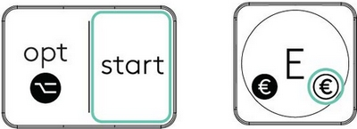
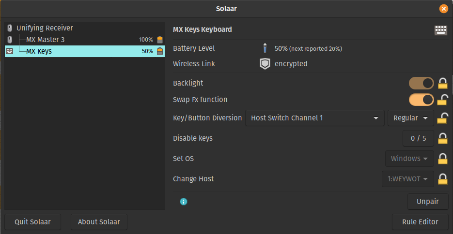
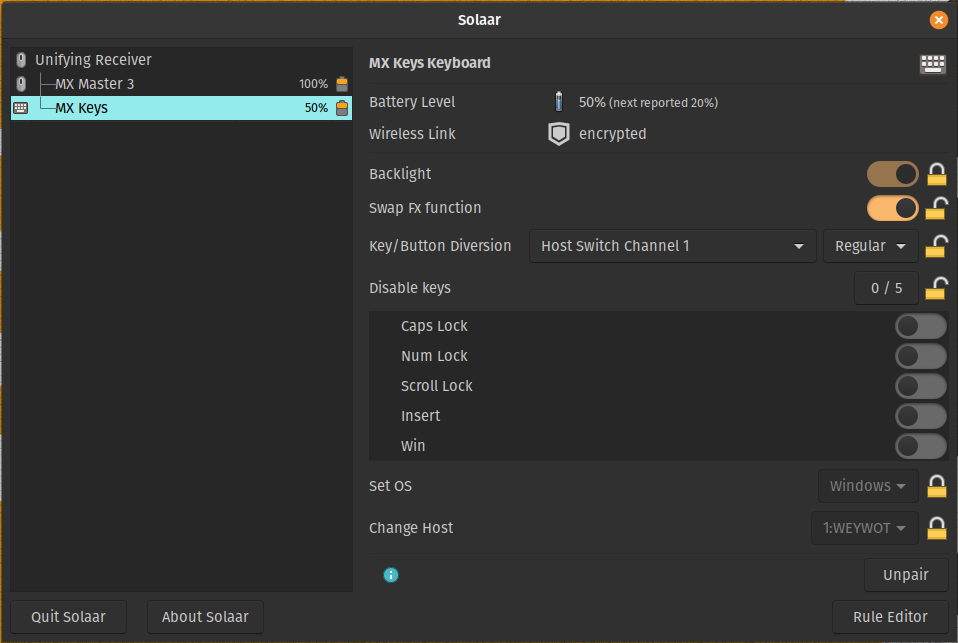
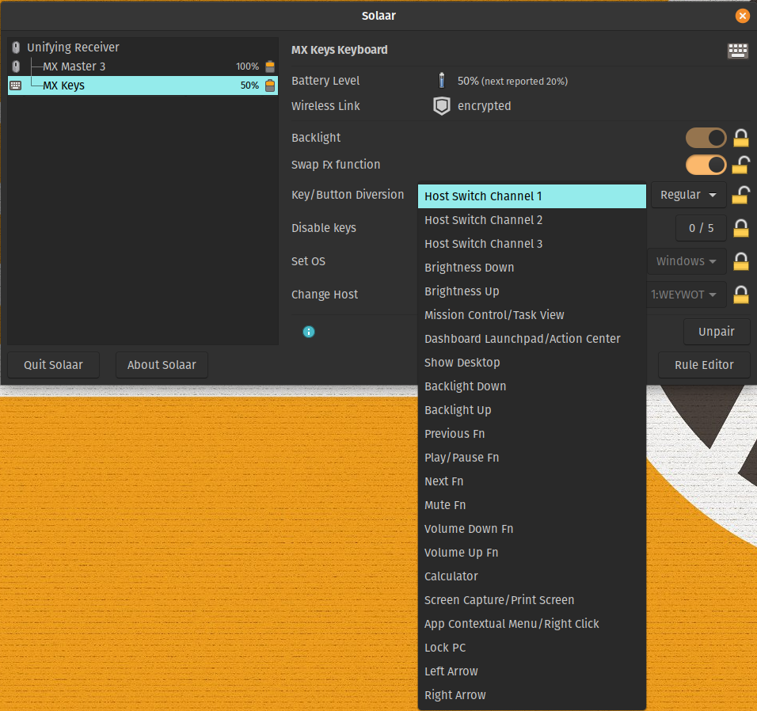
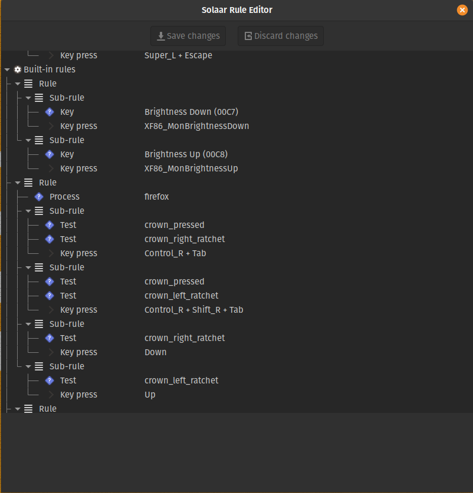
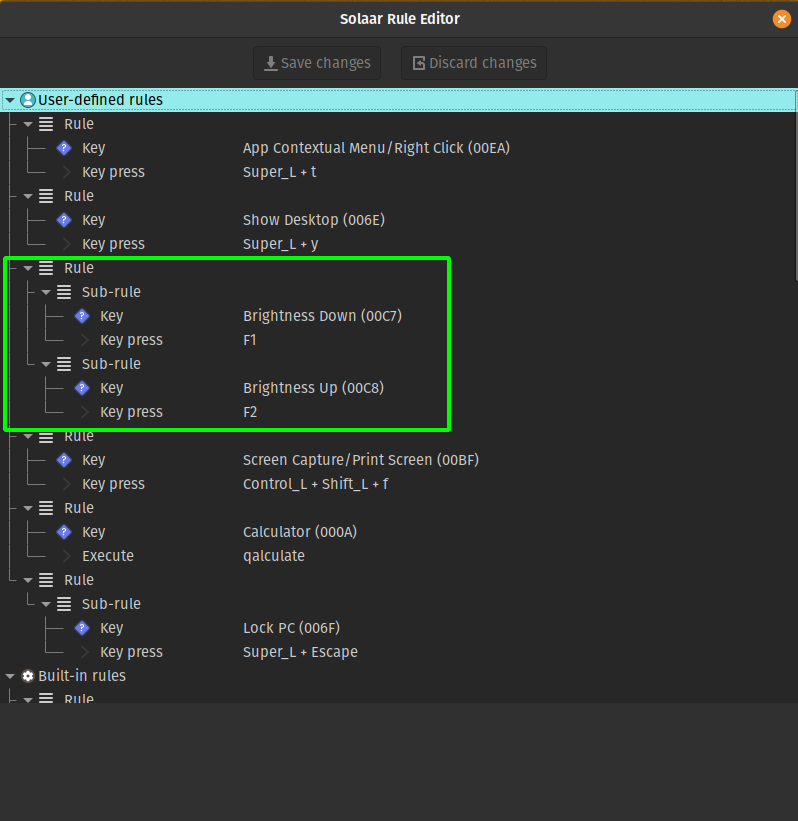
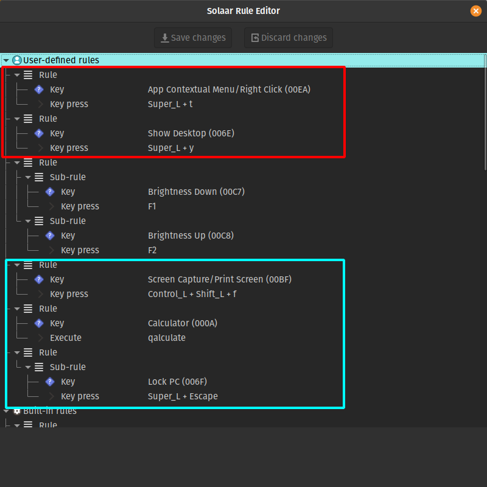
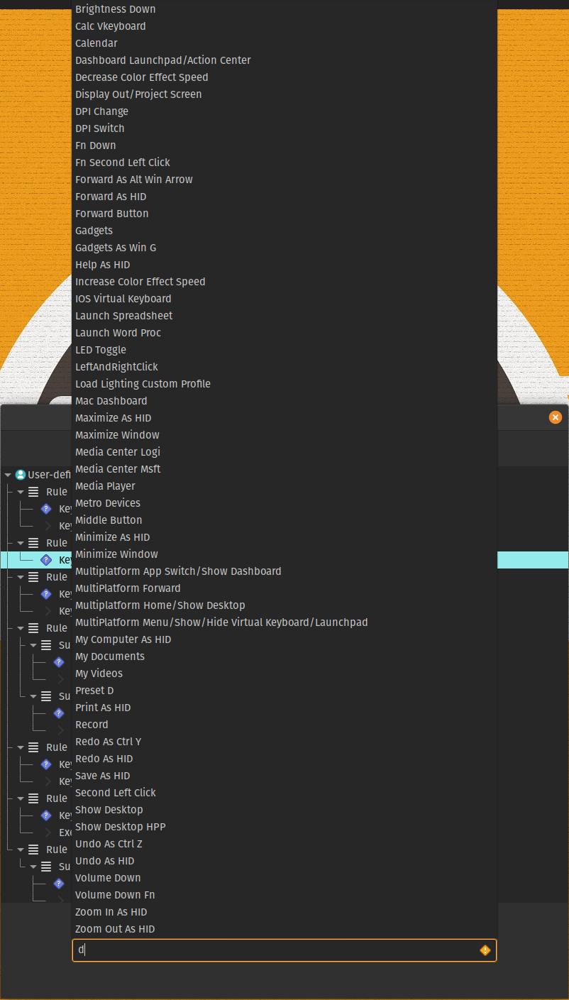

# Review and configure the Logitech MX Keys for linux (Pop!_OS)


The MX Keys has a layout for Windows/Linux and Mac. Notable the left hand side of the keys show the Windows/Linux functions and the right hand side the Mac functions.

 

## Standard use

These are the keycodes of the keys. 

### Function keys


#### In F-key mode

Keycodes from left to right:

| F1 | F2 | F3 | F4 | F5 | F6 | F7 | F8 | F9 | F10 | F11 | F12 | Sound Up |
|----|----|----|----|----|----|----|----|----|----|-----|-----|-----|
| 59 | 60 | 61 | 62 | 63 | 64 | 65 | 66 | 67 | 68 | 87 | 88 | 115 |

#### In Media-key mode 

You can modify to Media-key/Navigation mode by holding the **Fn** key while pressing the **F-keys**. 


Alternatively, you can **switch** to that mode with **Fn+Escape** as noted on the escape key bottom right corner.


From left to right:

| F1 | F2 | F3 | F4 | F5 | F6 | F7 | F8 | F9 | F10 | F11 | F12 | Sound Up |
|----|----|----|----|----|----|----|----|----|----|-----|-----|-----|
|   |   | 125+15 | 125+30 | 125+32 |  |  | 165 | 164 | 163 | 113 | 114 | 115 |

The following keys have **no keycodes**, and only perform specific functions.

| Key |  |  |  |  | 
|---|----|----|----|----|
| Name | Brigthness Down | Brigthness Up |  Backlight Down | Backlight Up | 

The **Sound Volume Up** key is not affected by the **Fn** key, and has the same keycode in either mode, **115**.
()

Rather **disappointingly** all three keys are hardware coded to (apparently) Windows specific shortcuts.

| Key |  |  |  | 
|----|----|----|----|
| Name | Mission Control/Task View| Dashboard Launchapd/Action Centre | Show Desktop |  
| Keycode | 125+15 | 125+30 | 125+32 |
| Shortcut | Super + Tab | Super + A | Super + D |

In standard gnome, these will actually work, but in Pop!_OS, *Super+d* is used **only in tiling mode** and as such that key doesn't do anything in normal mode. 
These keys cannot be changed with xinput, all that can be done is to use them and reshuffle the shortcuts from *gnome-settings*. 

However **solaar** is can make this keys perform other functions (see [solaar section](/guides/mxkeys_linux.md#solaar)).

### Easy Switching keys


These keys are named **Host Switch Channel 1**, **2** and **3**.

These are hardware keys and do not appear as keystrokes to the system. They are used to switch to different connected devices, as this keyboard can control three computers/tablets/phones via its **Unifying** USB dongle and/or **Bluetooth**.

These keys, may be used for other functions, however, using **solaar** (see solaar section).

### Numeric Keypad Top Row keys


The proper names of these keys, from left to right are:

| Key |  |  |  |  |
|---|----|----|----|----|
| Name | Calculator | Screen Capture/Print Screen | App Contextual Menu/Right Click | Lock PC | 
| Keycode | 140 | 99 | 127 | 125+38 |
| Shortcut |   |   |   | Super + L |  

Again, disappointingly he **lock** key is hardware coded to a Windows shortcut. This may work in standard gnome, but in Pop!_OS, lock has been moved to *Super+Esc*, so a new shortcut should be added in gnome-settings to make it work. 

Only  the **Context** key changes with **Fn** as follows:

| Fn+Context |
|----|
| 70 |

Again, **solaar** can change the functions of all these keys (see sollar section).

### Left and Right Control Keys


Notably the **Fn** key has been **moved to the right side** of the spacebar. This can be a **big issue** for those who want to use this keyboard with a laptop that normally has the **Fn** on the left side and as such now they have to break muscle memory. Personally, this is a big problem.


## Solaar

Solaar is the driver that currently supports (most) of Logitech's proprietary HID extension and offers (most) of the features available in Windows.

You will need the **latest version of solaar** from github to have full access to this keyboard's abilities.



Solaar offers Control for:

* Backlight on/off
* F-Keys swap 
* Key diversion (full customisation)
* Disable specific keys
* Select OS operation (Windows/Linux or Mac, iOS or Android)
* Change of host (same function as the three Easy Switch keys)

### Disable Keys



The **scroll lock** key is accessed with **Fn+Context** and has keycode **70**. 

### Key Diversion

Key diversion is the complete key customisation feature. In Windows this is done typically from the **Options** software by clicking on a key and selecting its use from a drop down menu. 
Solaar offers the same (if not better) level of customisation, using **rules**, accessed by the **Rule Editor** at the bottom right corner of the window. It is not as easy as clicking a key and setting its function, but it is very simple to use, and much simpler than **Options** if you edit the config file directly. 

These are the keys available to customise.



Interestingly, the **Left/Right** arrow keys are also customisable. 

Solaar comes with a set of preconfigured rules.




As seen above, the first rule with its two subrules make the **Brightness** keys work (for supported monitors and laptop screens). 
All other default rules are for mice and the Craft keyboard not covered here.

#### Custom rules

Once a key is diverted (set drop down to diverted from regular), it **disappears** from the system. It will **no** longer produce a keycode and it becomes a hardware key, handled by the driver. The keyboard does not have a programmable eprom, so all customisations are OS/Driver specific. 

##### Example customisations

Since my monitor does not support software brightness control (actually it does, but I never bothered to set it up), and my laptop is always docked when I use the MX Keys, I have no need of the screen brightness control keys.

Instead, I want them to behave as F1 and F2 keys at all times, regardless of the setting of the top row of keys.

As such I have diverted both these keys, and created the following rule.



This simply means that when the key named Brightnesss Down (00C7) is pressed, the F1 key is presented to the OS.
Similarly for the Brightness Up key for F2.

This rule can also be directly made by editing ```.config/solaar/rules.yaml```

~~~
---
- Rule:
  - Key: Brightness Down
  - KeyPress: F1
- Rule:
  - Key: Brightness Up
  - KeyPress: F2
...
~~~

This makes things so much easier. 

**Note:** Both these keys are already customised in the default rules to control the screen brightness. **Custom rules** overule the default ones (which cannot be edited/changed).

Further customisations include these:



In **cyan** I have set the **Screen Capture** key to access the same **gnome** shortcut I use to open **flameshot**. 
I also have the **Calculator** key opening **qualculate** rather than the stock program. 
You can see here, I could set the **Screen Capture** to directly run **flameshot**, but I did not.
Finally I remap the **Lock key** to **Super+Esc** to lock on press (Pop!_OS specific). 

In **red** I have changed the **Context** key to open a **terminal**, again, not by running a command, but simply issueing the same shortcut gnome uses **Super+T**.
And finally, the **Show Desktop** key is mapped to toggle the **tiling** mode (Pop!_OS specific).

A look into ```.config/solaar/rules.yaml``` looks like this:

~~~
%YAML 1.3
---
- Key: App Contextual Menu/Right Click
- KeyPress: [Super_L, t]
...
---
- Key: Show Desktop
- KeyPress: [Super_L, y]
...
---
- Rule:
  - Key: Brightness Down
  - KeyPress: F1
- Rule:
  - Key: Brightness Up
  - KeyPress: F2
...
---
- Key: Screen Capture/Print Screen
- KeyPress: [Control_L, Shift_L, f]
...
---
- Key: Calculator
- Execute: qalculate
...
---
- Rule:
  - Key: Lock PC
  - KeyPress: [Super_L, Escape]
...
~~~

The main (and only) advantage of creating rules using the GUI is that it offers you the names of the keys. 



**Note** Creating rules is rather easy, but it takes a few tries to understand the concept of cause effect. For basic customisations, the cause (what you do) is called a **condition** and the effect (what you want to happen) is called the **action**. More complicated customisasations are possible here, but describing how to do them is not the scope of this guide.


