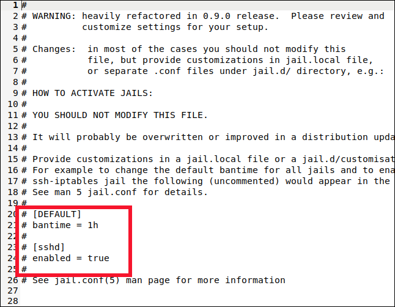

# Server SSH login with key and no 

With info from [here](https://erwinschleier.medium.com/connect-via-ssh-to-your-linux-server-7113695d8f80)
and for fail2ban, information from [here](https://www.howtogeek.com/675010/how-to-secure-your-linux-computer-with-fail2ban/)

Your server needs to have ```sshd``` installed. It normally is installed as a default.

## Configure the SSHD server

The config file is in ```/etc/ssh/sshd_config

The important bits are these:

~~~
HostKey /etc/ssh/ssh_host_rsa_key
HostKey /etc/ssh/ssh_host_ecdsa_key
HostKey /etc/ssh/ssh_host_ed25519_key

SyslogFacility AUTHPRIV

PermitRootLogin prohibit-password

AllowUsers otheos
Protocol 2
AuthorizedKeysFile	.ssh/authorized_keys

PermitEmptyPasswords no
PasswordAuthentication no

ChallengeResponseAuthentication no

GSSAPIAuthentication yes
GSSAPICleanupCredentials no

UsePAM yes

X11Forwarding yes

PrintMotd no

TCPKeepAlive yes
ClientAliveInterval 300
ClientAliveCountMax 6

AcceptEnv LANG LC_CTYPE LC_NUMERIC LC_TIME LC_COLLATE LC_MONETARY LC_MESSAGES
AcceptEnv LC_PAPER LC_NAME LC_ADDRESS LC_TELEPHONE LC_MEASUREMENT
AcceptEnv LC_IDENTIFICATION LC_ALL LANGUAGE
AcceptEnv XMODIFIERS

Subsystem	sftp	/usr/libexec/openssh/sftp-server
~~~

You need to enable and start the service: 

~~~
sudo systemctl enable sshd
sudo systemctl start sshd
~~~

This runs normally on port 22. You can change the port and then connect to it with ```ssh -p XX``` where XX is the new port.

## Remove passwords logins

This server now allows passwords log ins. This is a security issue if the ssh service is run externally. If it only runs internally its not a problem.

The passwords logins is controlled by this option in the pervious config file:

~~~
PasswordAuthentication no
~~~

To enable passwords logins you need to # this line.

While you have passwords log in open, you need to configure your keys. 

### Create keys on client

Each computer (or OS) that connects requires its own set of keys. A private (the client) and a public (the server). These are created on the client and copied to the server.

~~~
test@weywot:~$ cd .ssh
test@weywot:~$ ssh-keygen -t rsa
Generating public/private rsa key pair.
Enter file in which to save the key (/home/test/.ssh/id_rsa): id_pluto
Enter passphrase (empty for no passphrase): 
Enter same passphrase again: 
Your identification has been saved in id_pluto
Your public key has been saved in id_pluto.pub
The key fingerprint is:
SHA256:Cls9MT0UaAPEjqNxLmhLY3QIhZPTZibt3UvrZ18E8As test@weywot
The key's randomart image is:
+---[RSA 3072]----+
| *.  oo...o.     |
|B *   . +=       |
|.O.. + .E.=      |
| oo.= +. + +     |
|...=.o.oS . .    |
|.=o .+o. . .     |
|+ o....     .    |
| .    . o  .     |
|       o ..      |
+----[SHA256]-----+
~~~

Here I have named the file ```id_pluto``` to reflect the name of the client and know where it comes from. Any name is possible.
When asked for a passphrase, this is **only** for that key, and does not have to be the same as that of the user at any system (client or server).
You can use **no** passphrase to avoid having to type a password everytime you connect. But if you set one, that's the one you will need to type everytime you connect.

### Copy the public key to the server

*Note: you need to have ssh acces to the server via password at this point. You can disable it after this step is done.*

~~~
test@weywot:~$ ssh-copy-id -i ./id_pluto.pub otheos@ceres
~~~

Observe that the local user is ```test```, and the remote user I want to connect to is ```otheos```. 

You will be asked for that user's (```otheos```) password. This is **not** the passphrase, just the user passord to log in.

~~~
test@weywot:~$ ssh-copy-id -i ./id_pluto.pub otheos@ceres
/usr/bin/ssh-copy-id: INFO: Source of key(s) to be installed: "./id_pluto.pub"
/usr/bin/ssh-copy-id: INFO: attempting to log in with the new key(s), to filter out any that are already installed
/usr/bin/ssh-copy-id: INFO: 1 key(s) remain to be installed -- if you are prompted now it is to install the new keys
otheos@ceres's password: 
Warning: No xauth data; using fake authentication data for X11 forwarding.

Number of key(s) added: 1

Now try logging into the machine, with:   "ssh 'otheos@ceres'"
and check to make sure that only the key(s) you wanted were added.
~~~

Now you can disable password logins. Test you can connect.

## Secure the connection with fail2ban

Install it:

~~~
sudo apt-get install fail2ban

or

sudo dnf install fail2ban
~~~

Create the config file by copying the template (```.config```) to the ```.local``` (actual config) file.

~~~
sudo cp /etc/fail2ban/jail.conf /etc/fail2ban/jail.local
~~~

### Configure fail2ban

~~~
sudo pico /etc/fail2ban/jail.local 
~~~

Find these lines: 

